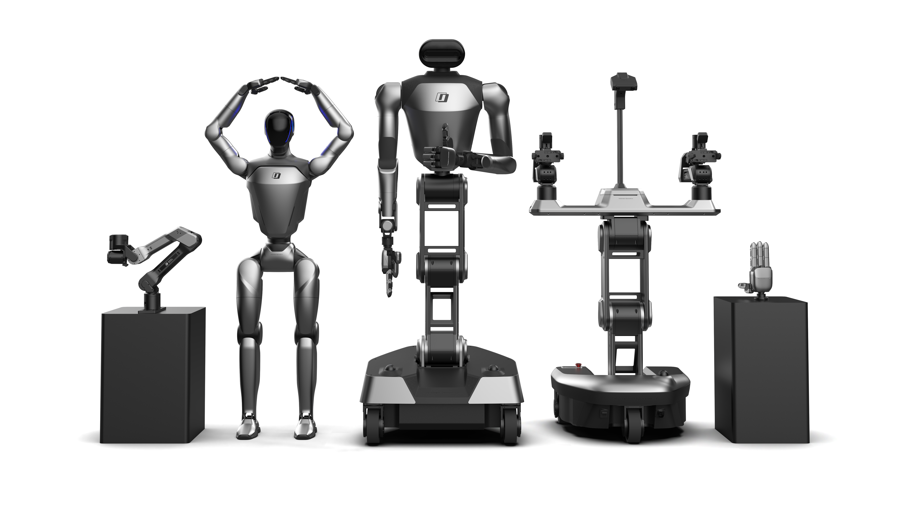

Founded in September 2023, Galaxea is a cutting-edge AI technology company specializing developing of Embodied AI foundation models and embodied AI robots. Anchored in its “Hardware + Intelligence” strategy and driven by an open, collaborative philosophy, Galaxea is dedicated to partnering with global leaders in Embodied AI to build and continuously empower a thriving ecosystem, bringing embodied AI technologies seamlessly into real-world applications and everyday life.

 ### 🤖 Galaxea A1Z

A1Z: Your First Desktop Smart Assistant – Ready to Use Out of the Box, Customizable for Any Scenario
   
  | 仓库 | 语言 | 用途 |
  |:-----|:----:|:-----|
  | [GALAXEA-A1Z](https://github.com/userguide-galaxea/GALAXEA-A1Z) | Python |A1Z 主仓库,机器人控制与开发核心代码 |
  | [OpenA1Z-T](https://github.com/userguide-galaxea/OpenA1Z-T) | Python | A1Z-T 遥操作系统 |
  | [a1z-lerobot](https://github.com/userguide-galaxea/a1z-lerobot) | Python | A1Z适配 LeRobot 框架的模型训练与部署 |
  | [a1z-data-collect](https://github.com/userguide-galaxea/a1z-data-collect) |Python | A1Z 遥操作数据采集脚本与工具 |
  | [URDF](https://github.com/userguide-galaxea/URDF) | CMake | 机器人URDF 模型文件 |

<!--
**userguide-galaxea/userguide-galaxea** is a ✨ _special_ ✨ repository because its `README.md` (this file) appears on your GitHub profile.

Here are some ideas to get you started:

- 🔭 I’m currently working on ...
- 🌱 I’m currently learning ...
- 👯 I’m looking to collaborate on ...
- 🤔 I’m looking for help with ...
- 💬 Ask me about ...
- 📫 How to reach me: ...
- 😄 Pronouns: ...
- ⚡ Fun fact: ...
-->
